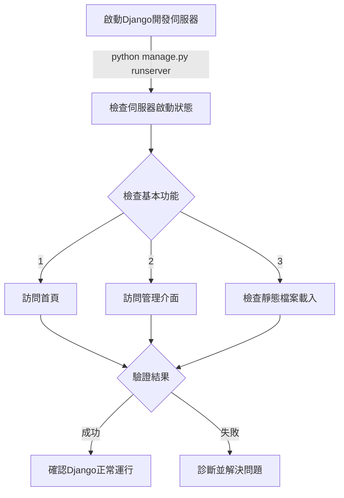

# Django 執行驗證計劃

## 執行步驟

### 1. 啟動開發伺服器
- 執行指令：`python manage.py runserver`
- 預期結果：伺服器成功啟動，無錯誤訊息

### 2. 驗證功能
- 訪問首頁 (http://localhost:8000)
- 訪問管理介面 (http://localhost:8000/admin)
- 確認靜態檔案（CSS、JS）載入狀態

### 3. 成功標準
- 伺服器無錯誤啟動
- 頁面正常載入
- 靜態資源正確顯示
- 控制台無重大錯誤警告